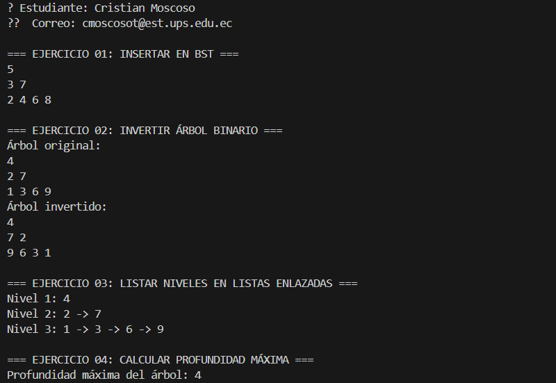

# 🌳 Estructuras No Lineales – Ejercicios con Árboles Binarios en Java

Este proyecto contiene la implementación de cuatro ejercicios prácticos sobre **árboles binarios** usando Java. El objetivo es reforzar los conceptos de estructuras de datos no lineales mediante ejercicios concretos que abordan inserción, inversión, recorrido por niveles y cálculo de profundidad en árboles binarios.

---

##  Estructura del Proyecto

```
src/
└── main/
    ├── Ejercicio_01_insert/
    │   └── InsertBST.java
    ├── Ejercicio_02_invert/
    │   └── InvertBinaryTree.java
    ├── Ejercicio_03_listLeves/
    │   └── ListLevels.java
    ├── Ejercicio_04_depth/
    │   └── Depth.java
    └── App.java
```

---

## Ejercicio 1: Insertar en Árbol Binario de Búsqueda (BST)

Carpeta: `Ejercicio_01_insert`

###  Explicación

Para insertar un valor en un árbol binario de búsqueda (BST), primero creamos una clase `Node` que contenga:

- Un valor entero (`value`)
- Un nodo izquierdo (`left`)
- Un nodo derecho (`right`)

Luego usamos un método de inserción recursivo:

- Si el nodo actual es `null`, creamos un nuevo nodo con el valor.
- Si el valor es menor al del nodo actual, se inserta a la izquierda.
- Si es mayor o igual, se inserta a la derecha.

Este proceso organiza los valores en un árbol de forma ordenada.

###  Ejemplo de Entrada

```java
int[] valores = {5, 3, 7, 2, 4, 6, 8};
```

###  Salida Esperada

```
        5
      /   \
     3     7
    / \   / \
   2   4 6   8
```

---

##  Ejercicio 2: Invertir un Árbol Binario

📁 Carpeta: `Ejercicio_02_invert`

###  Explicación

Invertir un árbol binario significa intercambiar los hijos izquierdo y derecho de cada nodo, en todos los niveles.

La lógica se basa en recursión:

- Si el nodo es `null`, se retorna `null`.
- Se invierten recursivamente los subárboles izquierdo y derecho.
- Luego se intercambian.

###  Ejemplo Visual

**Árbol original:**
```
        4
      /   \
     2     7
    / \   / \
   1   3 6   9
```

**Árbol invertido:**
```
        4
      /   \
     7     2
    / \   / \
   9   6 3   1
```

---

## Ejercicio 3: Listar Niveles en Listas Enlazadas

📁 Carpeta: `Ejercicio_03_listLeves`

###  Explicación

Este ejercicio genera una lista enlazada por cada nivel del árbol. Se usa un recorrido por niveles (BFS), utilizando una `Queue`:

- Se inicia agregando la raíz a la cola.
- Mientras haya nodos en la cola:
  - Se recorren todos los nodos de ese nivel.
  - Se almacenan sus valores en una lista enlazada.
  - Se agregan sus hijos a la cola para el siguiente nivel.

###  Ejemplo Visual

**Árbol:**
```
        4
      /   \
     2     7
    / \   / \
   1   3 6   9
```

**Salida esperada:**
```
Nivel 0: 4
Nivel 1: 2 → 7
Nivel 2: 1 → 3 → 6 → 9
```

---

##  Ejercicio 4: Calcular la Profundidad Máxima

📁 Carpeta: `Ejercicio_04_depth`

###  Explicación

La profundidad máxima de un árbol es la longitud del camino más largo desde la raíz hasta una hoja.

Usamos recursión:

- Si el nodo es `null`, la profundidad es 0.
- Calculamos la profundidad del subárbol izquierdo y derecho.
- Tomamos el mayor y le sumamos 1 (por el nodo actual).

###  Ejemplo Visual

**Árbol:**
```
        4
      /   \
     2     7
    / \
   1   3
        \
         8
```

**Profundidad máxima:** `4`

---

## Clase App y Pruebas

📄 Archivo: `App.java`

Esta clase es la encargada de ejecutar los ejercicios y mostrar los resultados en consola.


---


##  Conclusión

Esta práctica me ayudó a reforzar los conocimientos sobre estructuras de datos no lineales. Implementar árboles binarios desde cero me permitió comprender conceptos como recursión, recorrido BFS, árboles e inserciones ordenadas.


---

##  Autor

- **Nombre:** Cristian Moscoso
- **Correo:** cmoscosot@est.ups.edu.ec
- **Docente:** Ing. Pablo Torres

##
Imagen:
